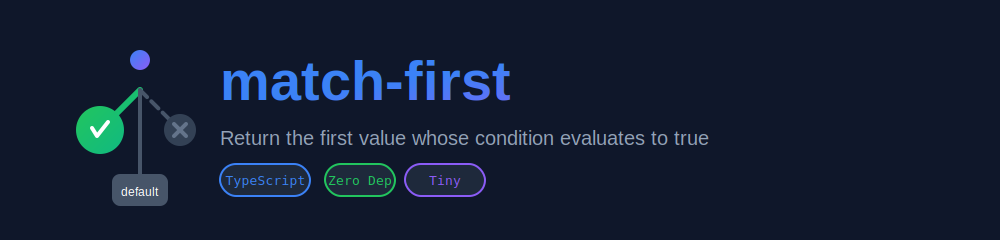

<p align="center">
  
</p>

<h1 align="center">match-first</h1>

<p align="center">Return the first value whose condition evaluates to true.</p>

[![version][version-image]][version-url]
[![license][license-image]][license-url]
[![size][size-image]][size-url]
[![download][download-image]][download-url]

## installation
```shell
yarn add @jswork/match-first
```

## usage
```ts
import { matchFirst } from '@jswork/match-first';

// Basic example: return first matching value
const result = matchFirst(
  [
    { condition: isHotfix, value: `hotfix ${id}` },
    { condition: taskType === 'bug', value: `bugfix ${id}` }
  ],
  `start ${id}`
);

// Conditional branching with fallback
const size = matchFirst(
  [
    { condition: x > 10, value: 'large' },
    { condition: x > 5, value: 'medium' }
  ],
  'small'
);

// Different value types
const config = matchFirst(
  [
    { condition: env === 'prod', value: { apiUrl: 'https://api.prod.com' } },
    { condition: env === 'staging', value: { apiUrl: 'https://api.staging.com' } }
  ],
  { apiUrl: 'http://localhost:3000' }
);
```

## license
Code released under [the MIT license](https://github.com/afeiship/match-first/blob/master/LICENSE.txt).

[version-image]: https://img.shields.io/npm/v/@jswork/match-first
[version-url]: https://npmjs.org/package/@jswork/match-first

[license-image]: https://img.shields.io/npm/l/@jswork/match-first
[license-url]: https://github.com/afeiship/match-first/blob/master/LICENSE.txt

[size-image]: https://img.shields.io/bundlephobia/minzip/@jswork/match-first
[size-url]: https://github.com/afeiship/match-first/blob/master/dist/match-first.min.js

[download-image]: https://img.shields.io/npm/dm/@jswork/match-first
[download-url]: https://www.npmjs.com/package/@jswork/match-first
